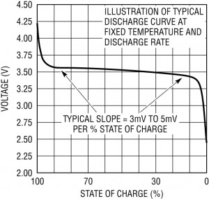
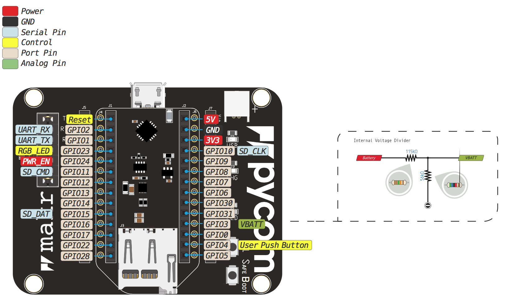
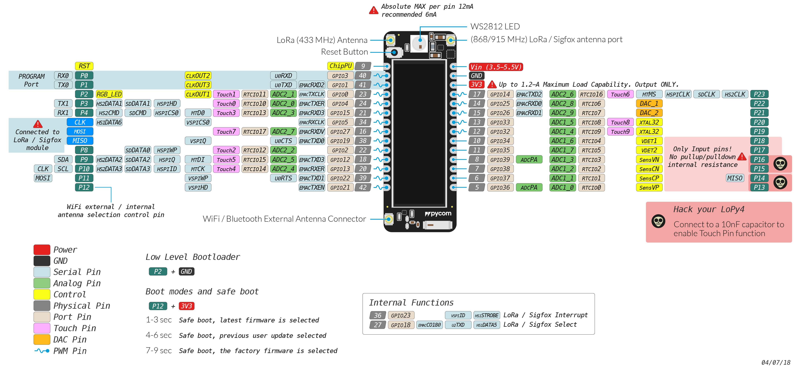

# Measuring Battery State

This project initially used the [Pycom Expansion Board V3.0](https://pycom.io/product/expansion-board-3-0/), which is designed to be connted to LiPo battery with the BQ24040 charging chip.

## General Notes about LiPo Battery

The discharge curve of LiPo is not linear as presented by the illustration below. 

In order to really monitor the evolution of the battery, the range of the ADC has to focus on a small range between 3.75V and 3.25V.

## Measuring the voltage

According to the pin out schema of the expansion board, the battery is connected to a voltage divider on the G3 pin on the expansion board which correspond to the pin P16.

## Alternative to Pycom expansion board to manage battery

MAX17043 

## Sources 
[pycom forum - LoPy with Expansion board, How do you measure LiPo Battery up to 4.2V?](https://forum.pycom.io/topic/1750/lopy-with-expansion-board-how-do-you-measure-lipo-battery-up-to-4-2v)  
[pycom forum - cant measure voltage from powerbank](https://forum.pycom.io/topic/6679/cant-measure-voltage-from-powerbank?lang=fr)
[PYCOM ADC documentation](https://docs.pycom.io/firmwareapi/pycom/machine/adc/)