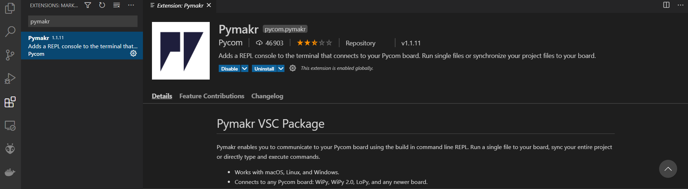

# Prerequisite - all tools require to use Pycom microcontroller

## 
* Install VS code 
* Install Pymakr add-on in VS Code

## Uploading software on the microcontroller

* Open VS Code 
* Open the folder project 

* Check the port of the micro controller

* Update the port in the `pymakr.conf` configuration file 
