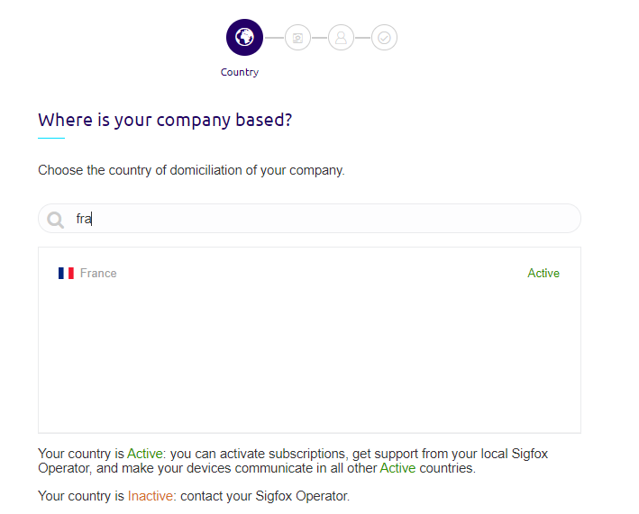
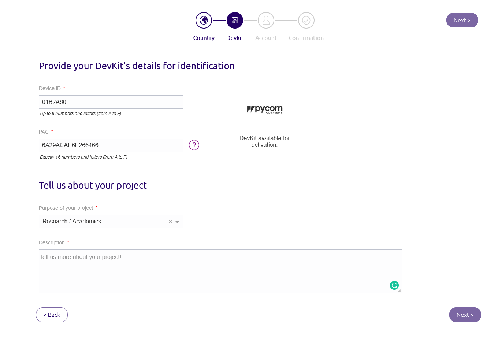
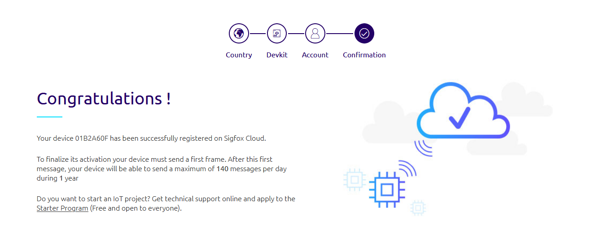

# Register MCU on Sigfox

* Step 1: Update the microcontroller

* Step 2: Go to [Sigfox activation page](https://buy.sigfox.com/activate)

* Step 3.A: If you already have an account on Sigfox, sign in with your login and password.

* Step 3.B: Choose the your country and then click on Next 

* Step 4: Copy the sigfoxID and the SigfoxPAC provided by the update procedure. 

* Step 5: If you are already logged in, you will autoamtically redirected to Step 6. Otherwise, enter all your information to create an account on Sigfox.

* Step 5: The add of the MCU will be confirmed.

