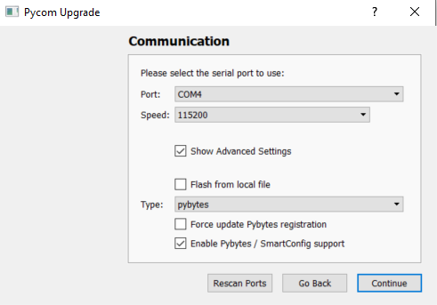
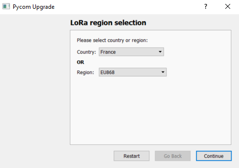

# Update the microcontroller with the latest firmware

## Procedure with the Expansion board

* Install [Pycom Upgrade](https://pycom.io/downloads/) ([Windows](https://software.pycom.io/findupgrade?product=pycom-firmware-updater&type=all&platform=win32&redirect=true) - [Mac](https://software.pycom.io/findupgrade?product=pycom-firmware-updater&type=all&platform=macos&redirect=true)- [Linux](https://software.pycom.io/findupgrade?product=pycom-firmware-updater&type=all&platform=macos&redirect=true))

* Close all IDE or any other software that might be using the serial port

* Start Pycom Upgrade

* Start the procedure

* Instructions

* Communication setup 

The has to correspond to those identified in VS Code.
Let the speed by default. 

* Choose the Pycom microcontroller used. In our experiment, we used the LoPy 4.

* Choose the Lora country

It is not used in our experimentation but it has to be configured.

* Choose the Sigfox region

* It summerize the parameters of the upgrade

I let the parameters as prompted. Once you press run, it will start the upgrade process, nothing to do except wait.

*  After around 2 minutes, you will see the results. 

If everything work properly, you will see 4 numbers you should keep somewhere because it will be necessary for activate Sigfox.

